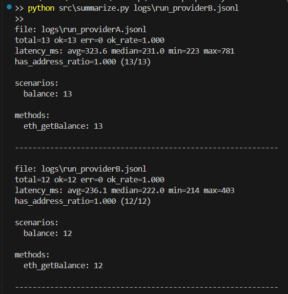

# CS6290 — Individual Evidence Pack (Milestone 1)
## Role: Developer / Tooling (RPC Privacy Measurement Harness)

**Name:** Rongke Xiao (GitHub: Kstechero)  
**Milestone:** 1  
**Repository:** https://github.com/Kstechero/wallet-rpc-privacy-measurement  
**Role selected in group:** Developer / Tool Developer 

---

## 1) What I contributed since the previous milestone

- Built a **config-driven RPC measurement harness** (Python) that can run controlled JSON-RPC workloads against Sepolia endpoints and log per-request metadata needed for privacy measurement (method, scenario, `has_address`, latency, status/error).
- Implemented a **structured JSONL logging pipeline** to support reproducibility and downstream analysis while minimizing sensitive data storage (stores `params_hash` + `has_address` rather than raw parameters by default).
- Added a **summarization script** to compute verifiable metrics from logs (success rate, latency stats, error breakdown, scenario/method distribution), enabling provider A/B comparisons.
- Prepared **ready-to-run experiment configs** for two providers and two baseline scenarios (`blocknumber`, `balance`) so teammates can reproduce runs without modifying code.

---

## 2) Evidence

| # | Evidence type | Link / Reference | What this shows |
|---|--------------|------------------|-----------------|
| 0 | repository | https://github.com/Kstechero/wallet-rpc-privacy-measurement | Public reference to all implementation and evidence artifacts listed below. |
| 1 | code | https://github.com/Kstechero/wallet-rpc-privacy-measurement/tree/main/src | Core harness implementation: config loading, JSON-RPC request loop, scenario selection, structured logging. |
| 2 | code | https://github.com/Kstechero/wallet-rpc-privacy-measurement/blob/main/src/summarize.py | Automated summarization of JSONL logs (ok_rate, latency stats, method/scenario counts, address-bearing ratio). |
| 3 | config | https://github.com/Kstechero/wallet-rpc-privacy-measurement/tree/main/configs | Reproducible experiment configs (Sepolia chain_id, provider RPC URLs, scenarios, address list). |

### Screenshot evidence

**Screenshot — Summarize output (matched workload: `balance`, ProviderA vs ProviderB)**  
What to capture: terminal output of `summarize.py` for **both** `logs/run_providerA.jsonl` and `logs/run_providerB.jsonl` under the same scenario (`balance`), showing `ok_rate`, `latency_ms` (avg/median/min/max), `has_address_ratio`, and scenario/method counts.

## 3) Validation I performed

### What I validated
- **Correctness and connectivity** of baseline JSON-RPC methods on Sepolia:
  - `eth_blockNumber` (address-free baseline)
  - `eth_getBalance` (address-bearing query)
- **Observability and error handling**:
  - failures (if any) are recorded as `status=error` with an error reason (e.g., timeouts / HTTP errors)
- **Metric integrity**:
  - `summarize.py` outputs match expected counts and the configured workload (scenario/method distribution and `has_address` behavior)

### How I validated it
- Ran the harness using config files for **providerA** and **providerB** on the same network (Sepolia) with controlled `duration_s` and `interval_s`.
- Generated JSONL logs and summarized them with `src/summarize.py`.
- Verified that:
  - balance runs produce `method=eth_getBalance` with `has_address=true`
  - (when executed) blocknumber runs produce `method=eth_blockNumber` with `has_address=false`
  - summary counts (`total`, scenario/method breakdown) are consistent with the run configuration

### Result
- For the recorded evidence runs, **both providerA and providerB completed successfully** for the matched `balance` workload (`ok_rate = 1.000` in the sample shown).
- No timeouts occurred in this sample; however, endpoint instability (timeouts/rate limiting) remains a realistic risk and will be evaluated with longer runs and higher request volume in later milestones.

---

## 4) AI usage transparency

- **AI tool used:** ChatGPT
- **How I used AI:** drafting documentation structure (how-to-run, field explanations), wording for evidence pack sections, and troubleshooting steps for Git/GitHub workflow issues.
- **One AI output I rejected (and why it was wrong, risky, or insufficient):**  
  Rejected the suggestion to use **only average (mean) latency** as the primary performance metric for comparing RPC providers. RPC latency is typically **heavy-tailed** and sensitive to **timeouts**, so the mean can be dominated by a few extreme values and lead to misleading conclusions. Instead, I used **median latency** plus **success/timeout rate** and max latency to reflect tail behavior and reliability.

---

