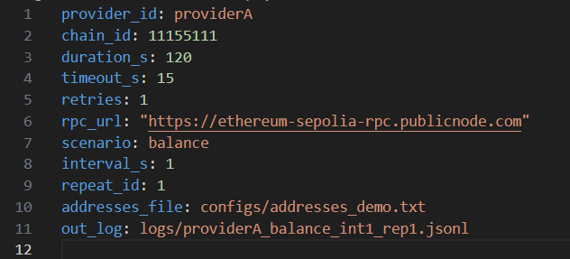
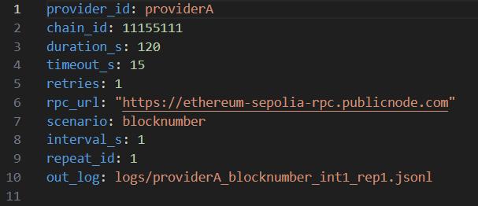
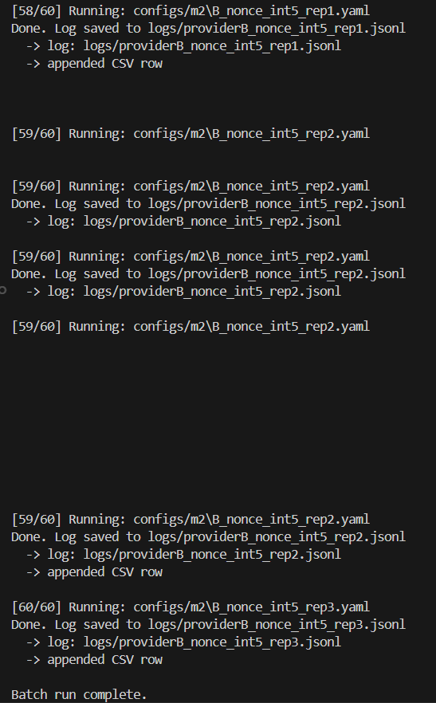

# CS6290 — Individual Evidence Pack (Milestone 2)
## Role: Developer / Tooling (RPC Privacy Measurement Harness)

**Name:** Rongke Xiao (GitHub: Kstechero)  
**Milestone:** 2  
**Repository:** https://github.com/Kstechero/wallet-rpc-privacy-measurement  
**Role selected in group:** Developer / Tool Developer  

---

## 1) What I contributed since the previous milestone

- Extended the harness from M1 “baseline demo runs” to an **M2 experiment matrix** that supports **A/B provider comparisons** under controlled workload parameters: **scenario × interval × replicate**.
- Implemented and organized **M2 configuration sets** under `configs/m2/` with systematic naming (`A|B_<scenario>_int<1|5>_rep<k>.yaml`) to enable **one-command batch execution** and reproducible re-runs.
- Strengthened end-to-end reproducibility by ensuring each experiment config writes to a deterministic log filename (`out_log`), and by producing a consolidated **CSV summary (`summary.csv`)** from batch runs for downstream analysis and reporting.
- Validated that address-dependent scenarios load addresses from `configs/addresses_demo.txt` and that logs are generated consistently for all runs across providers.

---

## 2) Evidence

| # | Evidence type | Link / Reference | What this shows |
|---|--------------|------------------|-----------------|
| 0 | repository | https://github.com/Kstechero/wallet-rpc-privacy-measurement | Public reference to all implementation and evidence artifacts listed below. |
| 1 | code | `src/runner.py`, `src/rpc_client.py`, `src/scenarios.py`, `src/logger.py` | Core harness implementation: config loading, JSON-RPC request loop, scenario selection, structured logging. |
| 2 | code | `src/batch_run.py` | Batch execution over an experiment set (`configs/m2/*.yaml`) and automatic appending of result rows into a CSV summary. |
| 3 | code | `src/summarize.py` | Automated summarization of per-run logs into verifiable metrics (`ok_rate`, latency distribution, error breakdown, `has_address_ratio`). |
| 4 | config | `configs/m1/` | Archived M1 baseline configs for backward-compatible reproduction of Milestone 1 evidence. |
| 5 | config | `configs/m2/` | M2 experiment matrix configs (provider A/B × scenario × interval × replicate). |
| 6 | result | `summary.csv` | Consolidated summary of all M2 runs (60 configs total), including `ok_rate`, latency stats, and `has_address_ratio`. |

### Screenshot evidence

**Screenshot 1 — Example M2 config (address-bearing scenario: `balance`)**  
What this shows: `configs/m2/A_balance_int1_rep1.yaml` includes `addresses_file` and a deterministic `out_log`.

**Screenshot 2 — Example M2 config (address-free control: `blocknumber`)**  
What this shows: `configs/m2/A_blocknumber_int1_rep1.yaml` omits `addresses_file`, serving as an address-free control workload.

**Screenshot 3 — Batch execution completion (matrix run)**  
What this shows: running the M2 matrix (`configs/m2/*.yaml`) completes end-to-end and appends result rows into `summary.csv`.

---

## 3) Validation I performed

### What I validated

- **Matrix coverage and reproducibility**:
  - All M2 configs were executed end-to-end (provider A/B × 5 scenarios × 2 intervals × 3 replicates = 60 runs) and produced a unified `summary.csv`.
- **Correctness and connectivity of JSON-RPC scenarios on Sepolia**:
  - Address-free control: `blocknumber` (`eth_blockNumber`)
  - Address-bearing workloads: `balance` (`eth_getBalance`), `nonce` (`eth_getTransactionCount`), `estimateGas` (`eth_estimateGas`)
  - Additional scenario coverage: `call` (`eth_call`) as implemented by `src/scenarios.py` (logged consistently across providers)
- **Observability and metric integrity**:
  - `ok_rate`, latency distribution (`avg/median/p95/max`), and `has_address_ratio` are recorded consistently per run and match the configured workload behavior.

### How I validated it

- Ran the M2 matrix with:

    python src/batch_run.py "configs/m2/*.yaml" summary.csv

- Verified that each config produced:
  - A log file written to the configured `out_log` path (e.g., `logs/providerB_nonce_int5_rep3.jsonl`)
  - A corresponding appended row in `summary.csv`

- Sanity-checked `summary.csv` for consistency:
  - `ok_rate = 1.000` for all 60 runs
  - `top_error_count = 0` for all runs
  - `has_address_ratio` aligns with scenario intent (address-dependent scenarios are consistently flagged as address-bearing in summary output)

### Result

- The M2 matrix run completed successfully with **60/60 configs executed**, and the consolidated `summary.csv` shows **100% success rate across all runs** (`ok_rate = 1.000`, `err = 0`).  
- Latency results show clear provider-dependent performance differences by scenario (median and tail latency vary across provider/scenario/interval), which is now measurable and reportable due to the M2 matrix structure.

---

## 4) AI usage transparency

- **AI tool used:** ChatGPT  
- **How I used AI:** generating/validating config matrix patterns (naming conventions and coverage), improving documentation phrasing for reproducibility, and creating checklists for evidence and validation steps.  
- **One AI output I rejected (and why it was wrong, risky, or insufficient):**  
  Rejected the suggestion to treat **mean latency alone** as the primary comparison metric. RPC latency is typically heavy-tailed, and a small number of slow requests can distort the mean. For M2 reporting, I emphasize **median (p50), p95, and success/error rate** to capture reliability and tail behavior more robustly.

---