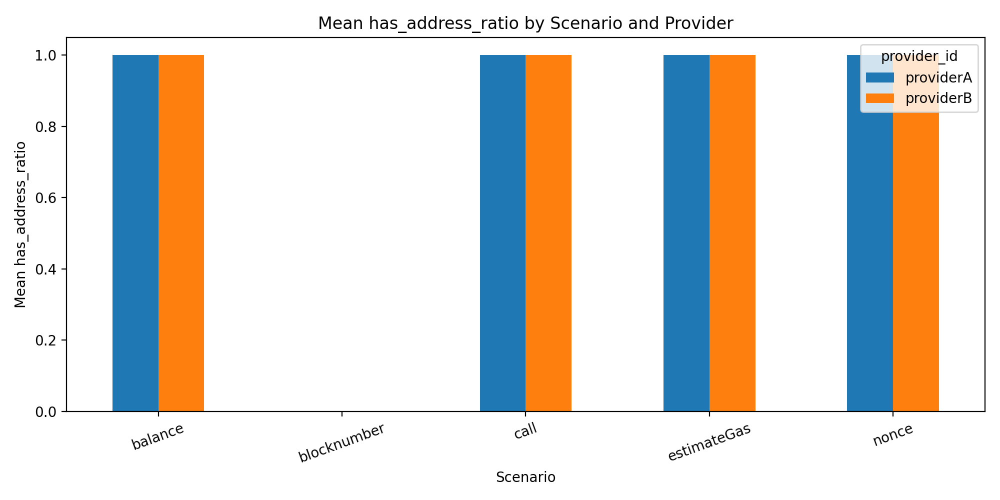
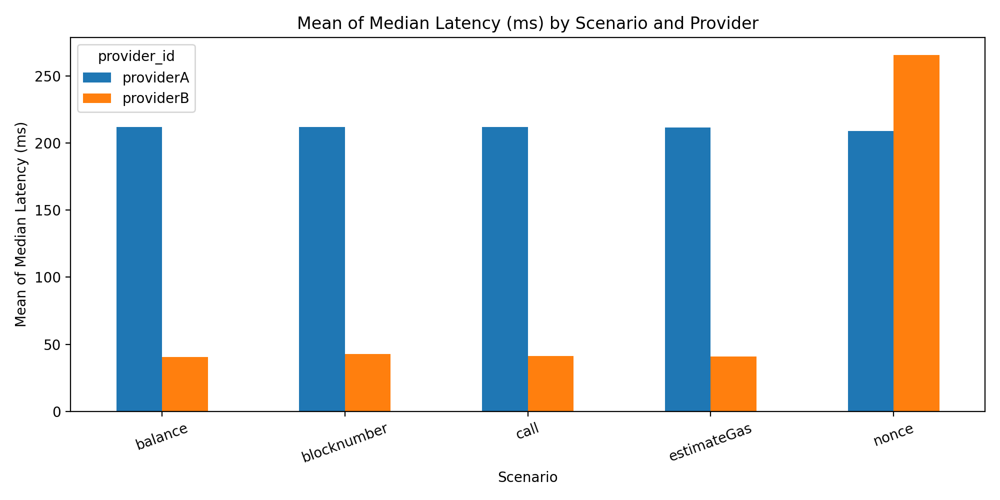
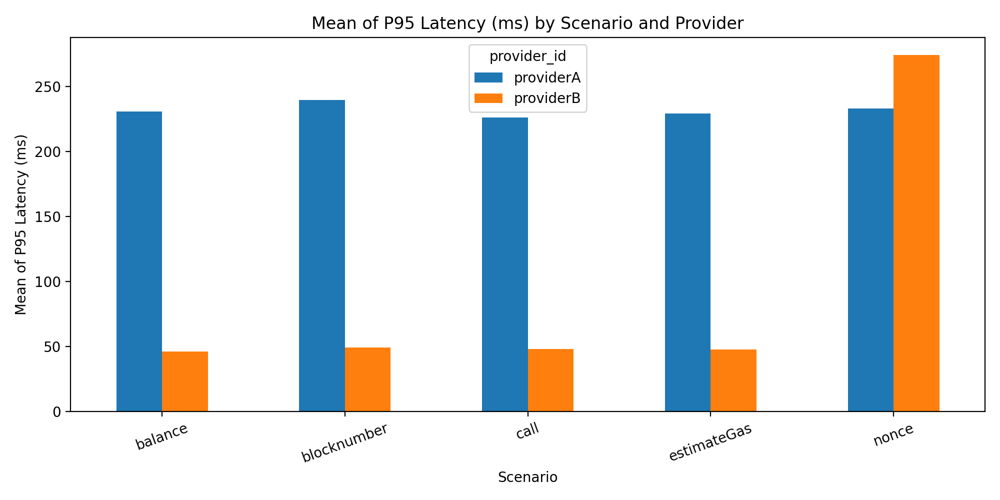
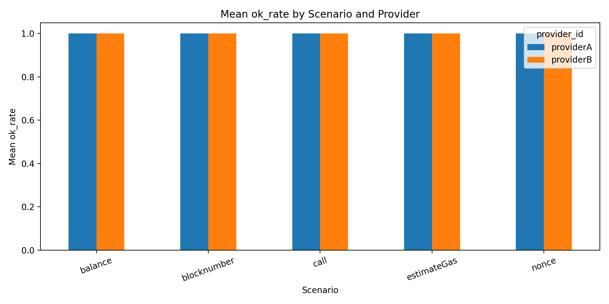

# CS6290 — Individual Evidence Pack (Milestone 3)
## Role: Developer / Tooling (RPC Privacy Measurement Harness)

**Name:** Rongke Xiao (GitHub: Kstechero)  
**Milestone:** 3  
**Repository:** https://github.com/Kstechero/wallet-rpc-privacy-measurement  
**Role selected in group:** Developer / Tool Developer  

---

## 1) What I contributed since the previous milestone

- Completed the project pipeline by extending the M2 experiment framework into a more complete **end-to-end measurement toolkit**: batch execution, structured summarization, and automated result visualization.
- Improved the batch experiment workflow so that repeated runs produce a **clean summary output** rather than accidentally appending stale rows from previous runs.
- Expanded the summarization layer to generate a richer consolidated CSV (`results/summary.csv`) with fields suitable for final analysis and reporting, including provider metadata, scenario metadata, latency statistics, and address-exposure indicators.
- Added an automated plotting step (`src/plots.py`) that converts the consolidated summary into final comparison figures for provider A/B evaluation across scenarios.
- Preserved the original M2 experiment matrix (`configs/m2/*.yaml`) to maintain continuity and comparability while improving the analysis and delivery pipeline around it.

---

## 2) Evidence

| # | Evidence type | Link / Reference | What this shows |
|---|--------------|------------------|-----------------|
| 0 | repository | https://github.com/Kstechero/wallet-rpc-privacy-measurement | Public reference to the final project code, experiment configs, result summaries, and documentation. |
| 1 | code | `src/runner.py`, `src/rpc_client.py`, `src/scenarios.py`, `src/logger.py` | Core request-generation and structured logging pipeline for JSON-RPC measurements. |
| 2 | code | `src/batch_run.py` | End-to-end batch execution over the experiment matrix and generation of a fresh consolidated CSV summary. |
| 3 | code | `src/summarize.py` | Final summarization logic producing per-run metrics used for comparison and plotting. |
| 4 | code | `src/plots.py` | Automated generation of final provider-comparison figures from `results/summary.csv`. |
| 5 | config | `configs/m2/` | The experiment matrix used for final runs (provider A/B × scenario × interval × replicate). |
| 6 | result | `results/summary.csv` | Consolidated final summary used as the main analysis table for Milestone 3. |
| 7 | figure | `results/figures/latency_median.png` | Median latency comparison across scenarios and providers. |
| 8 | figure | `results/figures/latency_p95.png` | Tail-latency comparison across scenarios and providers. |
| 9 | figure | `results/figures/has_address_ratio.png` | Address-bearing request ratio comparison across scenarios and providers. |
| 10 | figure | `results/figures/ok_rate.png` | Availability comparison across scenarios and providers. |

### Screenshot evidence

**Screenshot 1 — Final address-exposure comparison**  
What this shows: the figure `results/figures/has_address_ratio.png` verifies that the address-bearing proxy behaves as intended. `blocknumber` remains address-free (`has_address_ratio = 0`), while the other configured scenarios are detected as address-bearing under the current scenario definitions.

**Screenshot 2 — Final median latency comparison**  
What this shows: the figure `results/figures/latency_median.png` provides a provider A/B comparison of median latency by scenario, allowing final performance observations beyond raw logs.

**Screenshot 3 — Final p95 latency comparison**  
What this shows: the figure `results/figures/latency_p95.png` highlights tail-latency differences between providers and scenarios, which is more informative than average latency alone for RPC benchmarking.

**Screenshot 4 — Final availability comparison**  
What this shows: the figure `results/figures/ok_rate.png` confirms that all final experiment runs in the current matrix completed successfully, with `ok_rate = 1.0` across all scenarios and both providers.

---

## 3) Validation I performed

### What I validated

- **Final end-to-end reproducibility**:
  - The project can execute the full experiment matrix from configs, produce request-level JSONL logs, summarize results into a single CSV, and generate final figures from that summary.
- **Metric integrity**:
  - `ok_rate`, `median_latency_ms`, `p95_latency_ms`, and `has_address_ratio` are all produced consistently and can be traced back to the request-level logs.
- **Scenario semantics**:
  - `blocknumber` functions as the intended address-free control scenario.
  - `balance`, `nonce`, `call`, and `estimateGas` are represented as address-bearing scenarios under the current parameter construction logic.
- **Provider comparison capability**:
  - The final pipeline supports side-by-side comparison of provider A and provider B across all configured scenarios.

### How I validated it

- Executed the final experiment matrix with:

    python src/batch_run.py "configs/m2/*.yaml" results/summary.csv

- Generated final comparison figures with:

    python src/plots.py results/summary.csv results/figures

- Verified that:
  - a new `results/summary.csv` was created for the batch run,
  - all configured runs contributed rows to the final CSV,
  - all four figures were generated successfully under `results/figures/`,
  - the plotted `has_address_ratio` values matched the scenario design,
  - the plotted `ok_rate` values matched the successful batch run.

### Result

- The Milestone 3 pipeline completed successfully and produced a **final, report-ready output set** consisting of:
  - raw per-run logs,
  - a consolidated summary table,
  - and automated comparison figures.
- The final figures show that:
  - `blocknumber` remains an address-free control (`has_address_ratio = 0`),
  - the other configured scenarios are address-bearing under the current workload definitions,
  - all runs completed successfully (`ok_rate = 1.0`),
  - and provider-level latency differences are visible in both median and p95 comparisons.
- Compared with Milestone 2, the main improvement is not a new experiment matrix, but a **stronger analysis and delivery layer**: cleaner batch execution, richer summarization, and automated visual outputs suitable for final reporting.

---

## 4) AI usage transparency

- **AI tool used:** ChatGPT  
- **How I used AI:** improving project structure, refining experiment-pipeline code, generating plotting and summarization helpers, and improving the wording and organization of final documentation.
- **One AI output I rejected (and why it was wrong, risky, or insufficient):**  
  Rejected the suggestion to use **mean latency alone** as the primary performance comparison metric. In RPC measurements, latency distributions can be heavy-tailed, so averages may hide reliability differences. For the final version, I retained and emphasized **median latency, p95 latency, and success rate** as more robust indicators.

---

## final reproduction commands

- Run the full final experiment matrix:

    python src/batch_run.py "configs/m2/*.yaml" results/summary.csv

- Generate final figures:

    python src/plots.py results/summary.csv results/figures